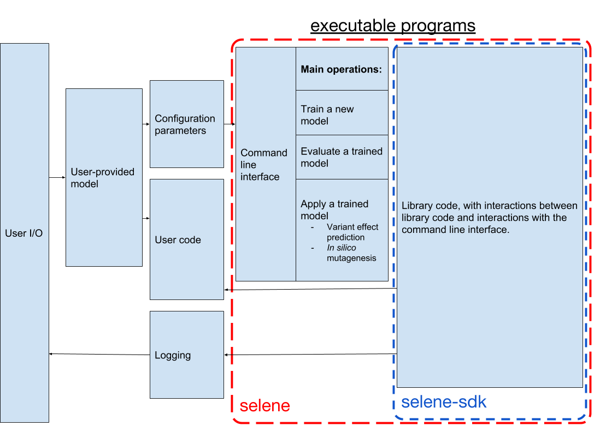

---

Selene is a Python library and command line interface for training deep neural networks from biological sequence data such as genomes.

## Installation

We recommend using Selene with Python 3.6 or above. 
Package installation should only take a few minutes (less than 10 minutes, typically ~2-3 minutes) with any of these methods (conda, source). We previously supported installation through pip, but we are refraining from releasing the latest version of Selene with pip until we resolve some issues we are observing with the pip installations of torch and torchvision.   

### Installing selene with [Anaconda](https://www.anaconda.com/download/) (for Linux):

```sh
conda install -c bioconda selene-sdk
```

### Installing selene from source:

First, download the latest commits from the source repository (or download the latest tagged version of Selene for a stable release):
```
git clone https://github.com/FunctionLab/selene.git
```

The `setup.py` script requires NumPy. Please make sure you have this already installed.

If you plan on working in the `selene` repository directly, we recommend [setting up a conda environment](https://conda.io/docs/user-guide/tasks/manage-environments.html#creating-an-environment-from-an-environment-yml-file) using `selene-cpu.yml` or `selene-gpu.yml` (if CUDA is enabled on your machine) and activating it.
These environment YAML files list specific versions of package dependencies that we have used in the past to test Selene.

Selene contains some Cython files. You can build these by running
```sh
python setup.py build_ext --inplace
```

Otherwise, if you would like to locally install Selene, you can run
```sh
python setup.py install
```

### Additional dependency for the CLI

Please install `docopt` before running the command-line script `selene_cli.py` provided in the repository.

## About Selene

Selene is composed of a command-line interface and an API (the `selene-sdk` Python package). 
Users supply their data, model architecture, and configuration parameters, and Selene runs the user-specified operations (training, evaluation, prediction) for that sequence-based model.

For a more detailed overview of the components in the Selene software development kit (SDK), please consult the page [here](http://selene.flatironinstitute.org/overview/overview.html).



## Documentation

The documentation for Selene is available [here](https://selene.flatironinstitute.org/).
If you are interested in running Selene through the command-line interface (CLI), [this document](https://selene.flatironinstitute.org/overview/cli.html) describes how the configuration file format (used by the CLI) works and details all the possible configuration parameters you may need to build your own configuration file. 

## Examples

We provide 2 sets of examples: Jupyter notebook tutorials and case studies that we've described in our manuscript. 
The Jupyter notebooks are more accessible in that they can be easily perused and run on a laptop. 
We also take the opportunity to show how Selene can be used through the CLI (via configuration files) as well as through the API. 
Finally, the notebooks are particularly useful for demonstrating various visualization components that Selene contains. 
The API, along with the visualization functions, are much less emphasized in the manuscript's case studies.

In the case studies, we demonstrate more complex use cases (e.g. training on much larger datasets) that we could not present in a Jupyter notebook.
Further, we show how you can use the outputs of variant effect prediction in a subsequent statistical analysis (case 3).
These examples reflect how we most often use Selene in our own projects, whereas the Jupyter notebooks survey the many different ways and contexts in which we can use Selene.

In general, we recommend that the examples be run on a machine with a CUDA-enabled GPU. All examples take significantly longer when run on a CPU machine.
(See the following sections for time estimates.)

### Tutorials

Tutorials for Selene are available [here](https://github.com/FunctionLab/selene/tree/master/tutorials).

It is possible to run the tutorials (Jupyter notebook examples) on a standard CPU machine--you should not expect to fully finish running the training examples unless you can run them for more than 2-3 days, but they can all be run to completion on CPU in a couple of days. You can also change the training parameters (e.g. total number of steps) so that they complete in a much faster amount of time. 

The non-training examples (variant effect prediction, _in silico_ mutagenesis) can be run fairly quickly (variant effect prediction might take 20-30 minutes, _in silico_ mutagenesis in 10-15 minutes). 

Please see the [README](https://github.com/FunctionLab/selene/blob/master/tutorials/README.md) in the `tutorials` directory for links and descriptions to the specific tutorials.   

### Manuscript case studies

The code to reproduce case studies in the manuscript is available [here](https://github.com/FunctionLab/selene/tree/master/manuscript).

Each case has its own directory and README describing how to run these cases. 
We recommend consulting the step-by-step breakdown of each case study that we provide in the methods section of [the manuscript](https://doi.org/10.1101/438291) as well.  

The manuscript examples were only tested on GPU.
Our GPU (NVIDIA Tesla V100) time estimates:

- Case study 1 finishes in about 1.5 days on a GPU node.
- Case study 2 takes 6-7 days to run training (distributed the work across 4 v100s) and evaluation.
- Case study 3 (variant effect prediction) takes about 1 day to run. 

The case studies in the manuscript focus on developing deep learning models for classification tasks. Selene does support training and evaluating sequence-based regression models, and we have provided a [tutorial to demonstrate this](https://github.com/FunctionLab/selene/blob/master/tutorials/regression_mpra_example/regression_mpra_example.ipynb).  
